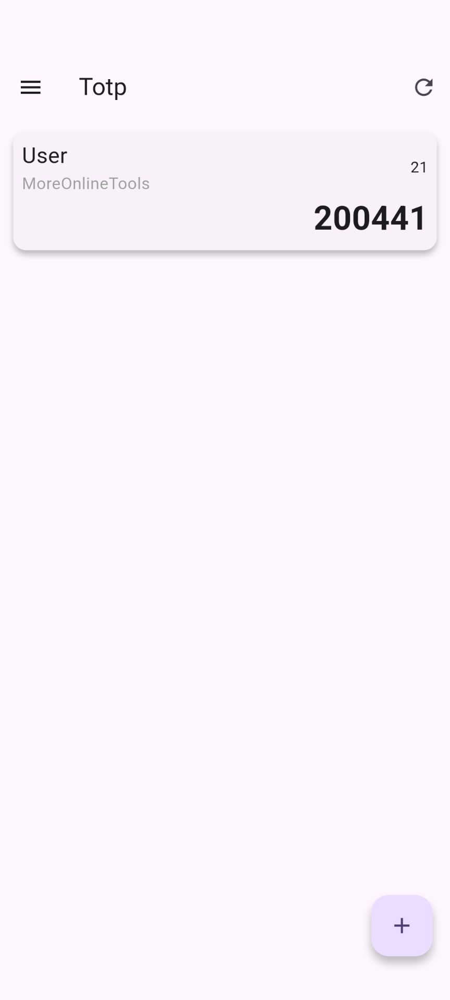
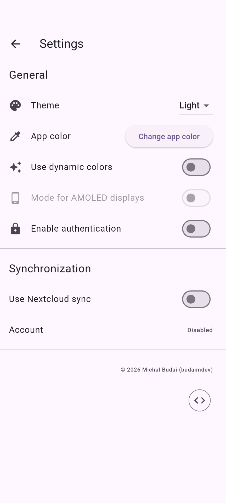

# 🔐 TOTP Authenticator

A modern, secure, and aesthetically pleasing Time-based One-Time Password (TOTP) manager built with
**Flutter**. This app provides a reliable way to generate 2FA codes for your accounts with a focus
on privacy and user experience.

## ✨ Features

- **Secure Access**: Biometric authentication (Fingerprint/FaceID) to keep your secrets safe.
- **Dynamic Theming**: Supports Material 3 with dynamic colors that adapt to your system theme.
- **AMOLED Mode**: True black theme for OLED screens to save battery and look sleek.
- **Easy Management**: Quick adding, editing, and bulk deletion of TOTP entries.
- **Local Storage**: All your secrets are stored locally on your device using a secure database.

## 📸 Screenshots






## 🛠️ Technical Stack

- **Framework**: [Flutter](https://flutter.dev)
- **State Management**: `ValueListenableBuilder` for reactive UI updates.
- **Storage**: Local SQLite database for persistence.
- **Security**: `local_auth` for biometric locking.
- **Theming**: `dynamic_color` for Android 12+ Material You support.

## 🚀 Getting Started

### Prerequisites

- Flutter SDK installed on your machine.
- A physical device or emulator.

### Installation

1. Clone the repository:
   ```bash
   git clone https://github.com/your-username/totp.git
   ```
2. Install dependencies:
   ```bash
   flutter pub get
   ```
3. Run the application:
   ```bash
   flutter run
   ```

---
*Designed for security and simplicity.*
